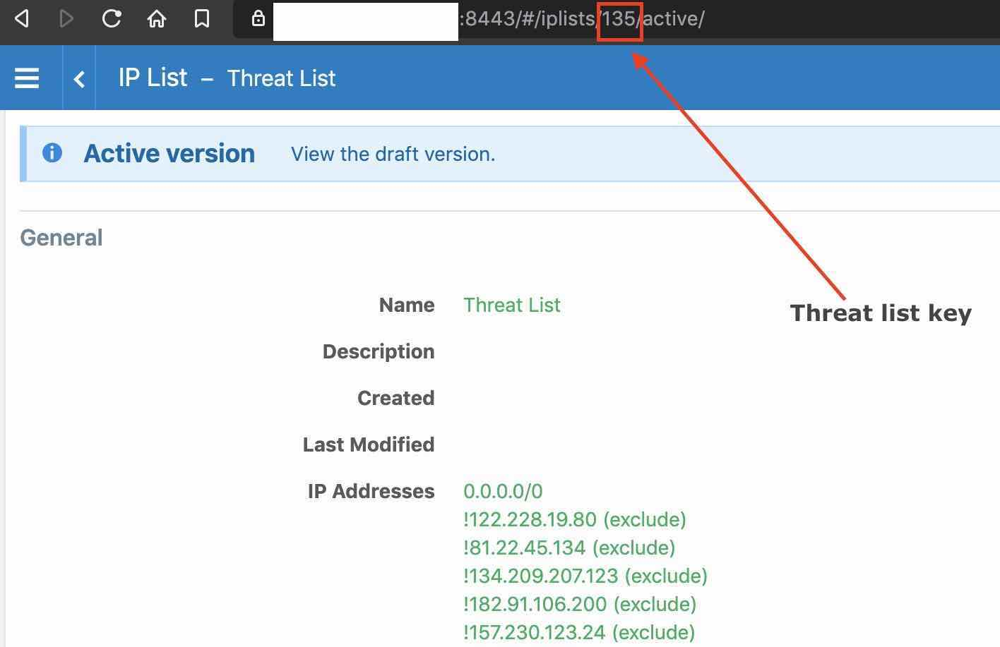

# IP Threat List Ingestion for Illumio ASP

[](http://slack.illumiolabs.com)
[](LICENSE)

This program takes external IP Threat Lists from the [config](src/config.py) file then pushes them to an Illumio PCE IP Threat List.

## Dependencies

This program is written for Python3, and tested up to v3.9. The program supports
Illumio PCE version 18.2.0 or newer.

## Installation

### Install Dependencies

1. Clone the illumio-ip-threat-list-ingestion repository and navigate to the directory
```bash
git clone https://github.com/illumiolabs/illumio-ip-threat-list-ingestion.git
cd ./illumio-ip-threat-list-ingestion
```
1. The dependencies required are documented in requirements.txt, use pip to install them
```bash
pip3 install -r requirements.txt
```

### Set Environment Variables

The following environment variables need to be defined before the program can run
```bash
export ILO_API_VERSION=2
export ILO_SERVER=<Illumio PCE URL> # The Illumio PCE hostname (ex. illumiopce.company.com)
export ILO_PORT=<Illumio PCE Port> # Illumio PCE port
export ILO_ORG_ID=<Illumio ORG ID> # Illumio PCE Org ID
export ILO_API_KEY_ID=<Illumio API KEY ID> # the api key from pce without the prefix 'api_'.
export ILO_API_KEY_SECRET=<Illumio API KEY Secret> # The API key secret
export THREAT_LIST_KEY=<Threat list ID> # Numerical ID of the IP List to be updated. It is found in the URL  as shown in image below.
```



## Usage
Run the program from command line and provide the URL when prompted
```bash
./src/illumio-ip-threat-list-ingestion.py
ip threat list url is:  https://raw.githubusercontent.com/stamparm/ipsum/master/levels/7.txt
malicious ip threat list fetched successfully.
current pce ip threat list: [ 171.25.193.77 , 171.25.193.20 ...<snip>... 185.100.87.207 ]
duplicate ips found in new list: [ 171.25.193.77 , 171.25.193.20 ...<snip>... 222.186.175.163 ]
ip threat list successfully updated in draft version, trying to provision now.
ip threat list successfully provisioned.
```

## Help or Docs

You can visit us at https://labs.illumio.com
If you have questions, please use slack or email to contact us directly.
If you have issues, bug reports, etc, please file an issue in this repository's Issue Tracker.

## Support

**IP Threat List Ingestion for Illumio ASP** is released and distributed as open source
software subject to the [LICENSE](LICENSE). Illumio has no obligation or responsibility related to
the **IP Threat List Ingestion for Illumio ASP** with respect to support, maintenance,
availability, security or otherwise. Please read the entire [LICENSE](LICENSE) for additional
information regarding the permissions and limitations. You can engage with the author & contributors
team and community on SLACK.

## Contributing

Instructions on how to contribute:  [CONTRIBUTING](CONTRIBUTING.md).
